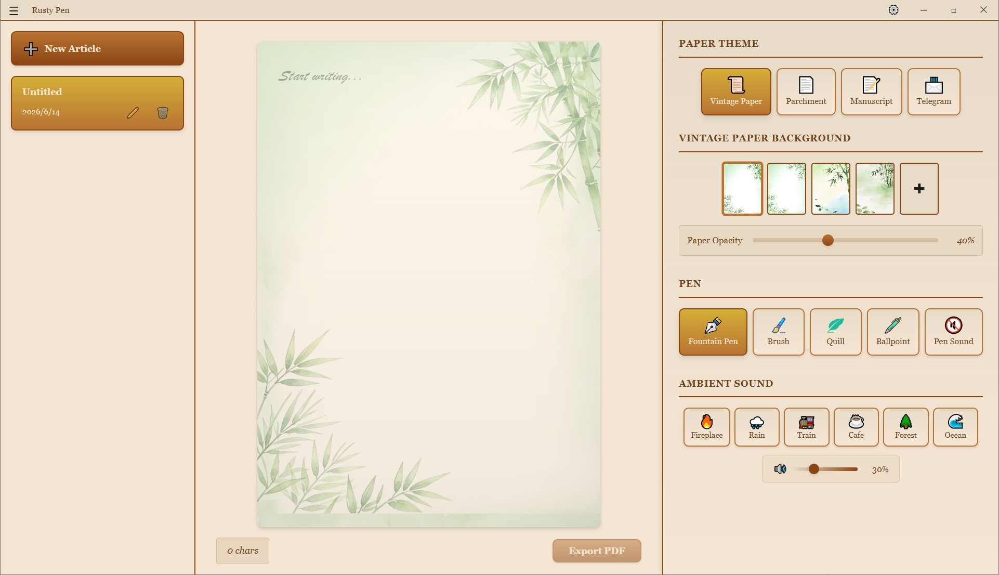
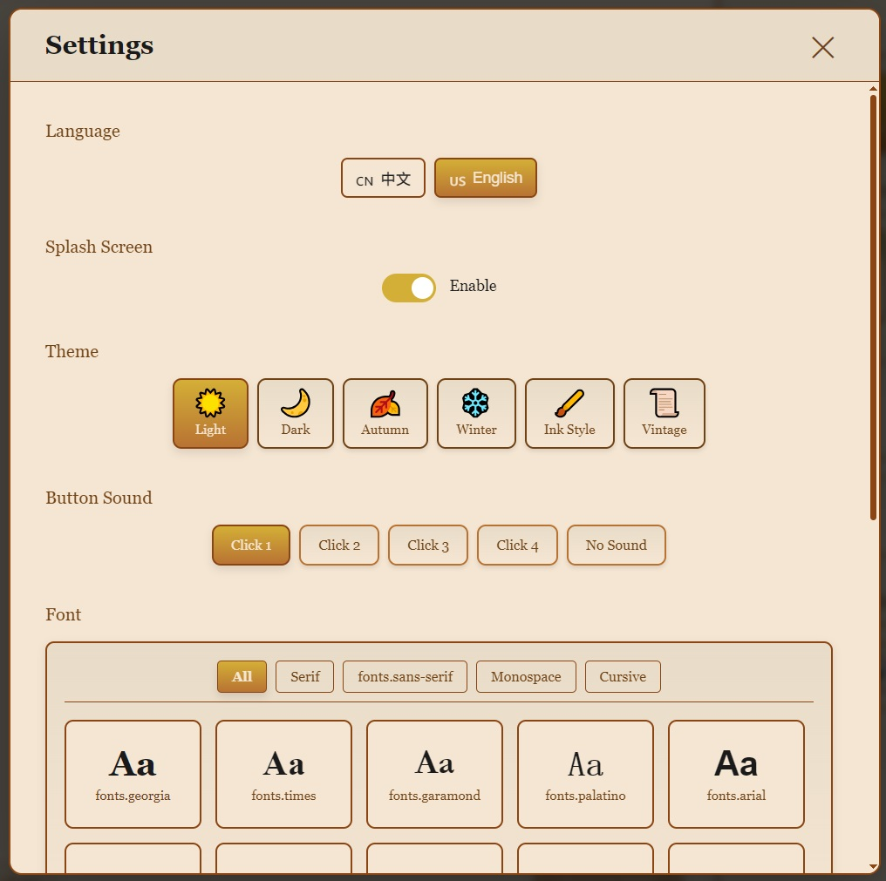
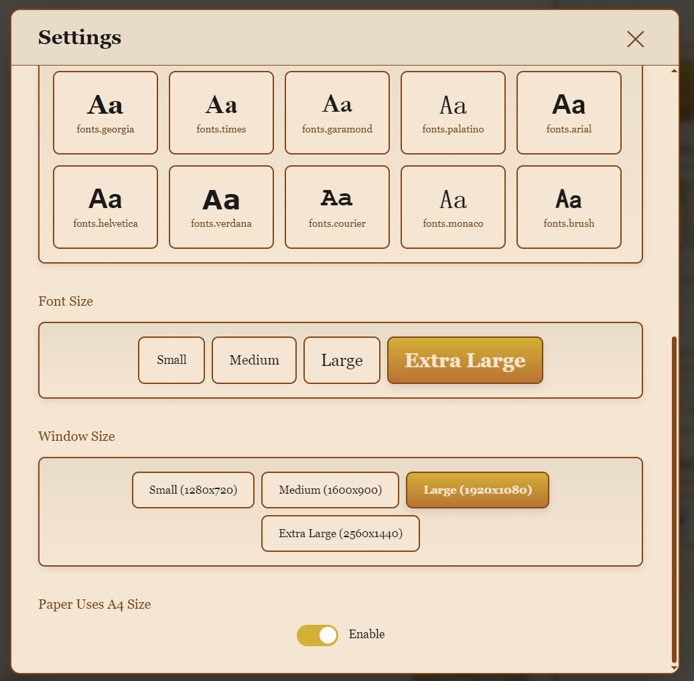

# Rusty Pen

> The pen is rusty. The mind isn't.

A vintage-inspired cross-platform writing application that brings the ritual of traditional writing to the digital age.

[🇨🇳 中文文档](README.zh.md)

## Screenshots

<div align="center">
  
</div>

<div align="center">
  
  
</div>

## 📱 iOS Version

Rusty Pen now has an iOS native SwiftUI version, available on the App Store:

[App Store Download Link](https://apps.apple.com/us/app/rusty-pen/id6759075369?mt=12)

## About

`Rusty Pen` is a name full of character, combining two powerful imagery:

- **Rusty**: Suggests retro, nostalgia, time-worn, slightly gritty - perhaps metaphorically "long unused" but still valuable
- **Pen**: Represents writing, creation, thoughts, manuscripts, diaries, signatures, art

This name naturally fits writing, note-taking, and creative tools, especially with a minimalist, artistic, vintage, or anti-distraction vibe.

## Product Vision

- **Type**: Cross-platform desktop application (Windows, macOS, Linux)
- **Style**: Minimalist UI + vintage animations + immersive sound effects
- **Differentiation**: Transform writing into a ritual and collecting experience
- **Positioning**: Spark creativity using "old-school methods" - simulate telegrams, stationery, and other traditional writing experiences
- **Target Users**:
  - Artistic youth, writers, diary enthusiasts
  - Digital minimalists (Anti-distraction)
  - People who love the feel of handwriting but rely on digital tools

## Core Features

### ✍️ Writing Experience

| Feature | Description |
|----------|-------------|
| **Pen Selection** | 4 pen types available: fountain pen, brush pen, feather pen, ballpoint pen. Each pen has unique font styles and writing sound effects |
| **Paper Themes** | 4 paper themes: vintage stationery, parchment, manuscript paper, telegram paper. Each theme has unique background and color scheme |
| **Custom Paper Background** | Support uploading custom background images to create your exclusive writing environment |
| **Paper Transparency** | Adjustable paper texture transparency to balance visual effects and readability |
| **A4 Aspect Ratio** | Option to use A4 paper aspect ratio, simulating real paper dimensions |
| **Font System** | Support multiple fonts, including Chinese fonts (Songti, Heiti, Kaiti, Fangsong, Microsoft YaHei, Round, Xingshu, Caoshu, Lishu, Shoujinti) and English fonts (serif, sans-serif, handwriting, etc.) |
| **Font Size** | 4 font sizes available: small, medium, large, extra large |
| **Pen Sound Effects** | Each pen has unique writing sound effects, can be toggled |

### 🎨 Visual Themes

| Feature | Description |
|----------|-------------|
| **Global Themes** | 6 global themes available: light, dark, autumn falling leaves, winter snowy night, ink style, vintage |
| **Startup Animation** | Book opening animation creating a sense of ritual |
| **Custom Title Bar** | Vintage-style title bar consistent with overall design |

### 📝 Article Management

| Feature | Description |
|----------|-------------|
| **New Article** | Quickly create new articles |
| **Article List** | Sidebar displays all articles |
| **Article Deletion** | Safe deletion with confirmation dialog |
| **Auto Save** | Article content automatically saved without manual operation |
| **Persistent Storage** | Article content persistently stored locally |

### 🔊 Sound System

| Feature | Description |
|----------|-------------|
| **Pen Sound Effects** | 4 pen types each have unique writing sound effects, can be toggled |
| **Button Sound Effects** | 4 click sound effects available to enhance interaction feedback |
| **Ambient Sound Effects** | 6 ambient sound effects available: fireplace, rain, train, cafe, forest, ocean waves, creating immersive writing atmosphere |

### 🌐 Internationalization

| Feature | Description |
|----------|-------------|
| **Multi-language Support** | Support Chinese and English interface switching |
| **Complete Translation** | All interface elements and prompt messages fully translated |

### 📄 Export

| Feature | Description |
|----------|-------------|
| **PDF Export** | Export articles as PDF format, preserving paper themes and styles |

### ⚙️ Settings

| Feature | Description |
|----------|-------------|
| **Global Theme Settings** | Switch application global theme |
| **Font Settings** | Select font and font size |
| **Window Size Settings** | 4 window sizes available: small, medium, large, extra large |
| **Startup Animation Toggle** | Option to show or hide startup animation |
| **Language Settings** | Switch interface language |

### 🖥️ Interface Components

- **Sidebar**: Article list and quick actions
- **Writing Area**: Immersive writing experience
- **Writing Settings Panel**: Quick adjustment of pens, papers, sound effects, etc.
- **Settings Modal**: Global settings options
- **About Modal**: Application information
- **Delete Confirmation Modal**: Safe deletion confirmation
- **Word Count**: Real-time display of article word count

## Visual & Interaction Design

- **Color Palette**: Rusty red, parchment yellow, ink black, copper green
- **Typography**: Primarily serif fonts, supplemented by handwriting fonts
- **Animations**: Slow fade-ins, paper curling, ink spreading
- **Icons**: Aged metal texture with slight oxidation spots
- **Cursors**: Each pen has unique cursor style
- **Scrollbars**: Traditional style, consistent with vintage theme

## Slogans

- The pen is rusty. The mind isn't.
- Where old ink meets new ideas.
- Your thoughts, unpolished and true.

## Subtitles

- A writing app for those who miss the weight of a real pen.
- No likes. No edits. Just you and the page.

## File Storage Format

Uses Tauri file system plugin for persistent storage.

## Tech Stack

- **Frontend Framework**: React 19
- **Build Tool**: Vite
- **Desktop Framework**: Tauri 2
- **Styling**: CSS custom variables
- **Audio**: Web Audio API for sound effects
- **PDF Export**: html2canvas + jsPDF
- **Icons**: SVG icons
- **Internationalization**: Custom I18n system

## Getting Started

### Prerequisites

- Node.js (v14 or higher)
- npm or yarn
- Rust (for Tauri development)

### Installation

```bash
# Clone the repository
git clone https://github.com/yourusername/rusty-pen.git

# Navigate to the project directory
cd rusty-pen

# Install dependencies
npm install
```

## Project Structure

```
rusty-pen/
├── public/
│   ├── cursors/          # Pen cursors
│   ├── icons/            # SVG icons
│   ├── images/           # Paper texture images
│   └── sounds/           # Audio files
│       ├── ambient/      # Ambient sound effects
│       ├── button/       # Button sound effects
│       └── pens/         # Pen sound effects
├── src/
│   ├── components/       # React components
│   │   ├── AboutModal.jsx
│   │   ├── BackgroundMusic.jsx
│   │   ├── ClickSoundSelector.jsx
│   │   ├── DeleteConfirmModal.jsx
│   │   ├── FontSelector.jsx
│   │   ├── FontSizeSelector.jsx
│   │   ├── ThemeSelector.jsx
│   │   ├── Header.jsx
│   │   ├── LanguageSelector.jsx
│   │   ├── PenIcon.jsx
│   │   ├── PenSelector.jsx
│   │   ├── SettingsButton.jsx
│   │   ├── SettingsModal.jsx
│   │   ├── Sidebar.jsx
│   │   ├── SplashScreen.jsx
│   │   ├── PaperSelector.jsx
│   │   ├── TitleBar.jsx
│   │   ├── VintagePaperSelector.jsx
│   │   ├── WindowSizeSelector.jsx
│   │   ├── WritingArea.jsx
│   │   └── WritingSettingsPanel.jsx
│   ├── contexts/         # React Context
│   │   └── I18nContext.jsx
│   ├── i18n/             # Internationalization files
│   │   ├── en.json
│   │   └── zh.json
│   ├── utils/            # Utility functions
│   │   ├── fontUtils.js
│   │   ├── languageUtils.js
│   │   ├── settingsUtils.js
│   │   ├── soundUtils.js
│   │   └── themeUtils.js
│   ├── App.jsx
│   ├── App.css
│   ├── main.jsx
│   └── index.css
├── src-tauri/            # Tauri backend
│   ├── src/
│   │   ├── lib.rs
│   │   └── main.rs
│   ├── capabilities/
│   │   └── default.json
│   ├── icons/            # App icons
│   ├── Cargo.toml
│   └── tauri.conf.json
├── index.html
├── package.json
├── vite.config.js
└── README.md
```

## Development

### Run Development Server

```bash
npm run dev
```

### Run Tauri Development Mode

```bash
npm run tauri:dev
```

### Build Desktop Application

```bash
npm run tauri:build
```

After building, the installation package is located in the `src-tauri/target/release/bundle/` directory.

## Contributing

Contributions are welcome! Please feel free to submit a Pull Request.

## License

This project is licensed under the **Rusty Pen Custom License (RPCL) v1.0**, which grants free use and modification rights, subject to the following conditions:

- ❌ **Not allowed** to distribute derivative works on any app store (e.g., Apple App Store, Google Play, Microsoft Store, etc.)  
- ❌ **Not allowed** for commercial use (including selling, advertising, SaaS, or monetization) without prior written permission  
- ❌ **Not allowed** to use the "Rusty Pen" name, logo, or confusingly similar branding  
- ✅ **Allowed** for personal and non-commercial use, including modification and redistribution (outside app stores)

📄 Full license terms: [LICENSE](LICENSE)  
📧 For commercial licensing inquiries: `fuxing.zhang@qq.com`

## Contact

For questions or suggestions, please open an issue on GitHub.

---

**Rusty Pen** - Where old ink meets new ideas.
